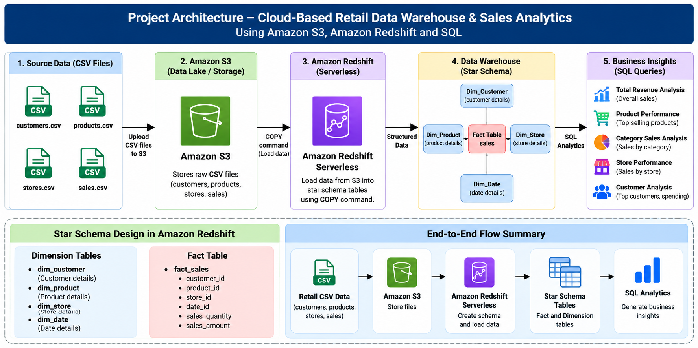

# Cloud-Based Retail Data Warehouse Using Amazon Redshift

## Project Overview

A cloud-based retail data warehouse solution developed using Amazon Web Services (AWS). The project demonstrates how retail sales data can be stored in Amazon S3, loaded into Amazon Redshift Serverless, organized using a star schema, and analyzed using SQL queries.

## Architecture

CSV Files → Amazon S3 → Amazon Redshift Serverless → SQL Analytics



## Technologies Used

- Amazon S3
- Amazon Redshift Serverless
- SQL
- AWS IAM
- GitHub
- CSV

## Data Warehouse Schema

The project follows a star-schema design consisting of:

### Dimension Tables

- `dim_customer` – Customer information
- `dim_product` – Product and pricing information
- `dim_store` – Store information

### Fact Table

- `fact_sales` – Sales transactions including quantity, date, and discount

## Data Pipeline

1. Retail CSV datasets are created for customers, products, stores, and sales.
2. CSV files are uploaded to Amazon S3.
3. Amazon Redshift Serverless is configured as the cloud data warehouse.
4. IAM permissions are configured to allow Redshift to access S3.
5. Dimension and fact tables are created in Redshift.
6. Data is loaded from S3 using the Redshift `COPY` command.
7. SQL queries are used to analyze sales performance.

## SQL Analytics

The project includes queries for:

- Total revenue
- Revenue by product category
- Store-wise sales performance
- Top-selling products
- Customer spending analysis

## Key Results

- **Total Revenue:** ₹130,400
- **Top Category:** Electronics
- **Top Product:** Laptop
- **Highest Revenue Store:** Coimbatore Store

## Benefits

- Centralized storage of business data
- Faster analytical queries
- Historical sales analysis
- Improved business intelligence
- Scalable cloud-based architecture
- Supports data-driven decision making

## Repository Structure

```text
cloud-retail-data-warehouse-redshift/
│
├── 01_create_schema_tables.sql
├── 02_load_data.sql
├── 03_verify_data.sql
├── 04_sales_analysis.sql
├── architecture.png
├── customers.csv
├── products.csv
├── sales.csv
├── stores.csv
└── README.md
